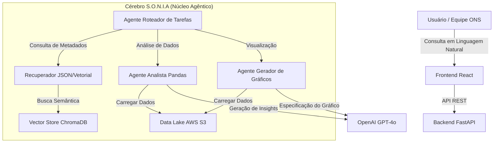

# S.O.N.I.A

**Um Sistema Multi-Agente para Democratização e Análise de Dados do ONS**

**Projeto vencedor do Hackaton ONS 2025** 🏆 [Ver Certificado](./Certificado1oLugar.pdf)

 

---

## 📋 Resumo
**S.O.N.I.A** é uma plataforma avançada impulsionada por IA, projetada para democratizar o acesso ao vasto e complexo Data Lake do **Operador Nacional do Sistema Elétrico (ONS)**. 

Ao aproveitar a **IA Agêntica**, Grandes Modelos de Linguagem (LLMs) e Busca Vetorial, a S.O.N.I.A transforma dados técnicos e isolados em insights acionáveis através de uma interface simples de linguagem natural em português.

## 🏗️ Arquitetura do Sistema

O sistema é construído sobre uma arquitetura modular baseada em microsserviços que separa a interação do frontend do raciocínio complexo do backend.

## 🧠 Showcase de Engenharia de Dados e IA
*Projetado eDesenvolvido por João Machado*

Este projeto representa uma implementação sofisticada de **RAG Agêntico (Retrieval-Augmented Generation)**, indo muito além de soluções simples de "chat com PDF".

### Inovações Técnicas Chave:

1.  **Orquestração Multi-Agente**:
    *   Em vez de um único prompt monolítico, utilizamos um **Agente Roteador** que classifica inteligentemente a intenção do usuário (ex: "Busca de Metadados", "Análise Complexa", "Solicitação Visual").
    *   Agentes especializados (Analista, Gráficos) são invocados dinamicamente, cada um com sua própria engenharia de prompt otimizada e conjunto de ferramentas.

2.  **Ingestão Dinâmica de Dados e Contexto**:
    *   O sistema inclui um **Pipeline de Ingestão S3** personalizado que percorre os buckets do ONS, lê dicionários de dados (JSON/PDF/CSV) e gera "Dossiês" semânticos para cada conjunto de dados.
    *   Esses dossiês são indexados no **ChromaDB**, permitindo que a IA entenda *quais* dados existem sem precisar carregar terabytes de CSVs no contexto.

3.  **Carregamento Inteligente de Dados**:
    *   Para otimizar custos e latência, o sistema emprega filtragem inteligente. Ele busca e carrega apenas os arquivos Parquet/CSV específicos do S3 que são relevantes para a consulta do usuário, determinados por um algoritmo de pontuação de relevância em dois estágios.

4.  **Autocorreção e Padrão ReAct**:
    *   Os Agentes de Análise comportam-se de forma iterativa usando o padrão **ReAct (Reasoning + Acting)**. Eles escrevem código Python para inspecionar dados, planejar sua análise, executá-la e autocorrigir-se caso ocorram erros (ex: incompatibilidade de nomes de colunas).

## 🚀 Principais Funcionalidades

*   **🗣️ Interface de Linguagem Natural**: Faça perguntas como *"Qual foi a geração total das usinas eólicas no Nordeste em 2024?"* e obtenha respostas imediatas.
*   **📊 Visualização Dinâmica**: Gera automaticamente gráficos interativos (Barras, Linhas, Pizza, Dispersão) com base na análise dos dados.
*   **🔍 Transparência**: Cada resposta inclui um rastro do "Processo de Pensamento" e cita os datasets específicos do S3 consumidos.
*   **⚡️ Alta Performance**: Otimizado com cache e processamento assíncrono para respostas rápidas.

## 🛠️ Instalação e Configuração

### Pré-requisitos
*   Node.js 18+
*   Python 3.10+
*   Credenciais AWS (configuradas para acesso ao bucket de Dados Abertos do ONS)
*   LLM API key

---
*Criado para o **Hackathon ONS 2025**. Empoderando dados de energia através da inteligência.*